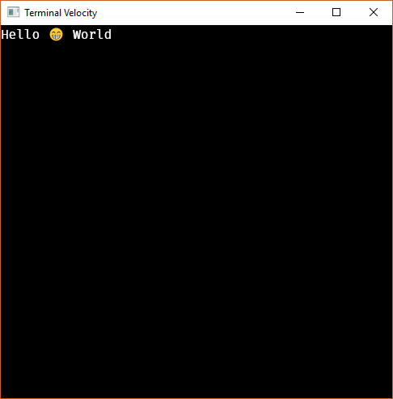

# Terminal Velocity

Terminal Velocity is a pretty fast terminal emulator for Windows that uses DirectWrite (GPU and Warp) for rendering. [iTerm2 functionality is planned.](https://github.com/jcdickinson/tv/issues?q=is%3Aissue+is%3Aopen+label%3Aiterm2-parity) MacOS and Linux support is plausible but unplanned; there are many great terminal emulators for these platforms.

## Installation

You can grab a build off of [AppVeyor](https://ci.appveyor.com/project/jcdickinson/tv/build/artifacts), but these builds will be varying degrees of useless depending on development progress. Simply unzip and run tv.exe.

## Development

Terminal Velocity is in the storming stage of development, so I will probably ruin any forks. It's probably best to avoid forking this repo for now.

## License

MIT licensed. Portions (anything to do with VT/ANSI) are [Apache License 2.0.](https://github.com/jwilm/alacritty/blob/master/LICENSE-APACHE)